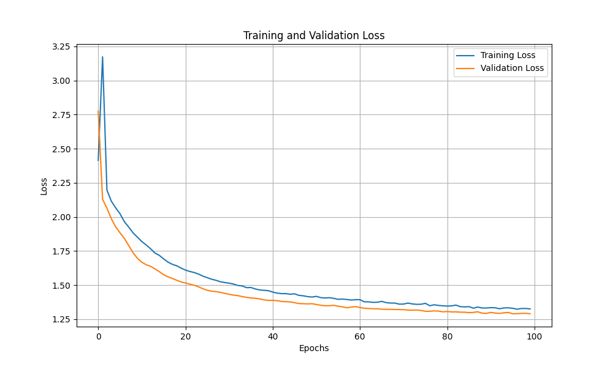

**GNN (Graph Neural Network)**
In this repository, I am defining a Graph Neural Network on the dataset of CIFAR10 the results contains the Graphs created on different percentages of the dataset and the created subgraph. 

The nodes of the graphs represents the images in the datasets.
The edges of the two nodes are formed using the similarity of the features of resnet18 model

The result contains the final graph created using the above idea and finally, the PCA is applied before visualization of the graph. 

After, that the subgraph which gives the optimal information is extracted.

Final code for the construction of the graph with memory efficiency and performance evaluation of the subgraphs can be regenrated using the code gnn_v5_visualize_graph.py and for subgraph please use the code subgraph_v1.py

Constructed Graph :

Loss Plot for Graph Learning:

